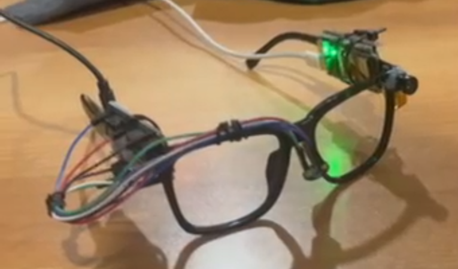
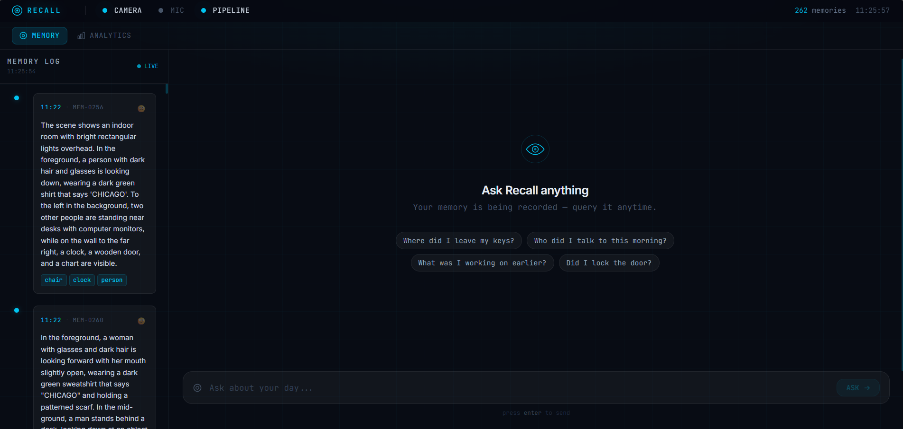
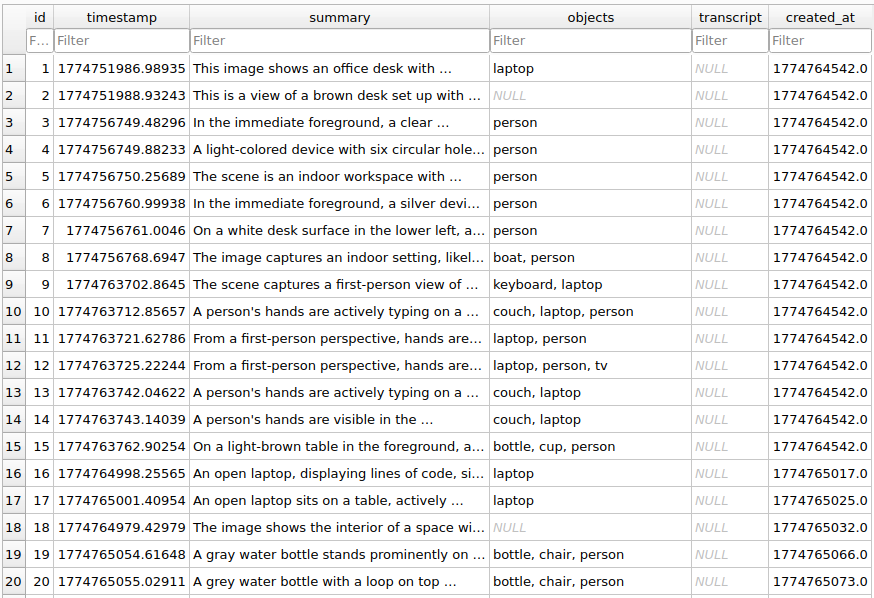

# Recall | 🏆 2nd Best Overall @ HackUSF 2026

### Links 🔗: [Devpost](https://devpost.com/software/recall-oswlh3) | [Demo Video](https://www.youtube.com/watch?v=Htq-73zA4mw)

## Team: Stevin George, Sebastian Noel, Nicole Bustos, Chris Ho

### Summary
Recall is a wearable AI memory assistant integrated into glasses, designed to support individuals with cognitive impairment or memory loss. It restores autonomy by acting as a passive, "always-on" observer that remembers daily details on the user’s behalf.

- Passive Capture: Continuously records visual and audio data.

- Natural Language Queries: Users can ask questions like "Where did I leave my keys?" and receive timestamped audio answers.

- Semantic Search: Uses AI to understand the meaning of scenes, allowing for intuitive memory retrieval.

### Hardware

Built using two ESP32 microcontrollers mounted directly onto glasses frames:

- ESP32-S3: Handles video via an OV2640 camera module, streaming MJPEG frames over WiFi.

- ESP32-WROOM-32E: Captures 16kHz mono audio using an INMP441 I2S MEMS microphone.

- Connectivity: Custom multi-endpoint HTTP and TCP socket streaming to a local processing pipeline.

### Software
- Vision Pipeline: Processes video batches using YOLOv8 for object detection and Gemini 2.5 Flash for rich, spatial scene descriptions.

- Memory Engine: Stores data in SQLite and uses ChromaDB vector embeddings to enable "meaning-based" (semantic) search.

- Audio & Voice: Transcribes environmental audio via ElevenLabs Scribe and delivers verbal responses using ElevenLabs TTS.

- Dashboard: A Next.js web interface featuring a live memory timeline, mood analytics, and hardware health monitoring.
---
**Dashboard**

**Database**

---
### Tech Stack

- AI/LLMs: Google Gemini 2.5 Flash, ElevenLabs (Scribe v2 & TTS).

- Computer Vision: Ultralytics YOLOv8, OpenCV.

- Databases: ChromaDB (Vector DB), SQLite.

- Frontend: Next.js 16, TypeScript, Tailwind CSS, Recharts.

- Backend: Python, Flask (Multi-threaded architecture).

- Firmware: C++ (ESP32 / Arduino).

